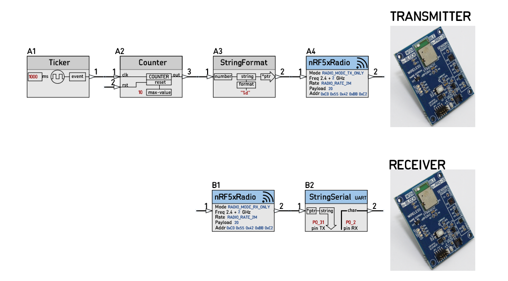
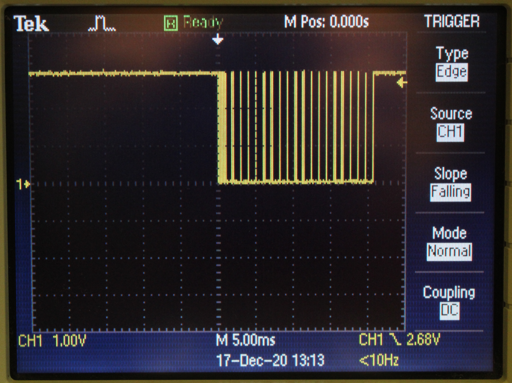

# [FIRMWARE_18D_radio_test](https://github.com/nBlocksStudioApps/FIRMWARE_18D_radio_test)

`mbed-os5.15 bare-metal` project for [Design 18D_radio_test](https://github.com/nBlocksStudioApps/18D_radio_test)

----

Signal at Receiver UART pin P0_31 is as expected, a new 9600-Baud_rate pulsetrain is received... :heavy_check_mark:

----
...every sec :heavy_check_mark:

----
The testing setup:
 *  Testing with batteries  :heavy_check_mark:
 *  The Receiving Board is connected to the oscilloscope
 *  The range covers about 20m inside a domestic building :heavy_check_mark:

----